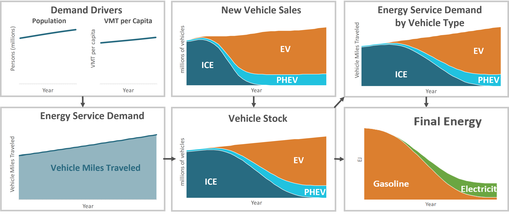
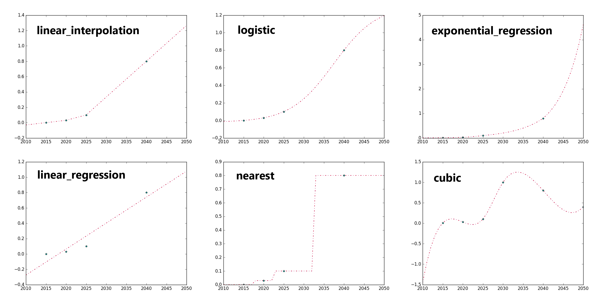

====================
Model Methodology
====================

Additional methodology detail can be found in the U.S. Annual Decarbonization Perspective technical documentation released by Evolved Energy Research. The link to the 2023 report is here: https://www.evolved.energy/2023-us-adp

Methodology overview
====================

The EnergyPATHWAYS model is a comprehensive energy accounting and analysis framework specifically designed to examine large-scale energy system transformations. It accounts for the costs and emissions associated with producing, transforming, delivering, and consuming energy in an economy. It has strengths in infrastructure accounting and electricity operations that separate it from models of similar types. It is used, as it has been in this analysis, to calculate the effects of energy system decisions on future infrastructure, emissions, and costs to energy consumers and the economy more broadly. 

The model works using decision-making "stasis" as a baseline. This means, for example, that when projecting energy demand for residential space heating, EnergyPATHWAYS implicitly assumes that consumers will replace their water heater with a water heater of a similar type. This baseline does, however, include efficiency gains and technology development required by codes and standards or reasonably anticipated based on techno-economic projections. If there are deviations from the current system in terms of technology deployment, these are made explicit in our scenario with the application of measures, which represent explicit user-defined changes to the baseline. These can take the form of adjustments of sales shares measures (changes in the relative penetration of technology adoption in a defined year) or of stock measures (changes to the amount of technology deployment by a defined year).

EnergyPATHWAYS was specifically built to investigate energy system transformations, and to this end, the model leaves most energy system decisions to the user. Thus, it is appropriate to think of EnergyPATHWAYS as a complex accounting system or simulation model that keeps track of and determines the implications of detailed user decisions. Each intervention by the user on the energy system is referred to as a measure and the calculation of the model with no measures the *base case*.

Demand-side calculations start with a set of inputs we call demand drivers. These are variables such as population or the value of industrial shipments and can be thought of as the skeleton upon which the rest of the model calculations depend. Ideally demand driver projections for future years are given, but if only historical data is available, EnergyPATHWAYS will use different regression techniques to project each variable across all model years.

Along with service demand, technology stocks that satisfy each service demand are tracked and projected into the future. The composition of the stock along with the efficiency of each stock type for providing services is referred to as the service efficiency, fuel economy being a classic example. Total energy demand can be calculated by dividing service demand by service efficiency across and summing across each service demand category, referred to in the model as demand subsectors. The demanded energy will be in one of many different fuel types (E.g. electricity or natural gas) depending on the technologies deployed and will be specific to a geography, customer category, and even time slice, as is the case with electricity.
   
Example subsector calculation
=============================

This section walks through a simple example from beginning to end to illustrate how EnergyPATHWAYS determines final energy demand for a subsector that includes both stock and service demand inputs.

In the figure below, the top left graph shows the demand drivers population and vehicle miles traveled (VMT) per capita across a long stretch of years. The base demand driver here would likely be population since it is common to find exogenous population projections across many geographies. With a long-term forecast for population and historical data on VMTs, VMTs per capita are projected for future years to create the second driver.

   **Demand Side Light Duty Auto Example**

Following the arrow and multiplying population by VMT per capita gives us total service demand for the vehicles, which is the first intermediate output. Next, starting at the Energy Service Demand box, the arrow to the right takes us to vehicle stock, with several intermediate steps not shown.

One reasonable question is, how do does one know the total number of vehicles in future years, let alone composition? In this example the total number of vehicles is dependent on service demand, which in practical terms means that service demand becomes a driver for a projection of total vehicle fleet size. If, for example, it is assumed that annual VMT per vehicle remains constant, dividing total annual VMTs by average annual VMT per vehicle will give us an estimate for the total vehicle stock. Conversely, the model could have been set up so that the service demand in VMT was dependent on the total stock instead. In this case, calculations would have started from demand drivers that might have included population and per capita vehicle ownership and the number of future vehicles would have been projected first. Notice that these two approaches result in different conceptual framing as to what drives energy demand in a subsector and could result in very different outputs, depending on the underlying data.

Once total stock is projected, the stock rollover can be run to determine the vehicle composition over time. Users of the EnergyPATHWAYS model make explicit decisions on the share of sales between internal combustion engines (ICE), electric vehicles (EV), and plug-in hybrid electric vehicles (PHEV) over time. When vehicles from the existing stock retire after reaching the end of their service lifetime, each is replaced in portion to their respective sales shares. These new sales, shown in the upper right graph result in the stock composition pictured. Close observation will show a noticeable lag between when the sales shares by technology and the makeup of the overall fleet. This is indicative of the infrastructure inertia encountered in the energy system and is a critical dynamic in understanding how such a system evolves.

Once Energy Service Demand and Total Stock by technology is calculated, service demand is allocated to the individual technologies, shown in the next box down. On the surface, this allocation could be as simple as assuming that each car in the fleet drives the same number of miles per year; however, in practice a more complex allocation can be made with the right inputs, such as the fact that new vehicles are driven more than older vehicles or the fact that some technologies satisfy a larger or smaller proportional share of service demand.

With service demand allocated, technology service efficiency, in this case miles-per-gallon gasoline equivalent, is used to arrive at final energy for gasoline and electricity. 

Demand Subsectors
==================
Subsectors represent separately modeled units of demand for energy services. These are often referred to as end-uses in other modeling frameworks. EnergyPATHWAYS is flexible in the configuration of subsectors, and methods used in each subsector depend on data availability. 

Subsector types
---------------

Data availability determines subsector granularity and informs the methods used in each subsector. The methods for projecting energy demand are listed below from the most the least prefered method:

- **Stock and Service**
- **Stock and Energy Demand**
- **Service and Energy Demand**
- **Energy Demand**

Data Methods
===========================

Projecting data for future years
--------------------------------
The figure below illustrates six interpolation and extrapolation methods used to fill in missing years for model calculations.

   **Example methods used to interpolate and extrapolate data across model years**

The full list of cleaning methods is contained within the python file time_series.py and are listed below:

**linear_interpolation**
  Straight line between provided data points.

**linear_regression**
  Slope and intercept is calculate given the provided points. Origional data is replaced.

**logistic**
  s-curve function that is fit using different methods depending on how many data points are provided.

**cubic**
  Cubic spline using the scipy library.

**quadratic**
  Quadratic spline using the scipy library.

**nearest**
  Data is filled based on the nearest provided data point.

**exponential_interpolation**
  Exponential function is used to fill between provided points. Extrapolation will use the exponential growth rate if given in the data.

**exponential_regression**
  Fits an exponential using the polyfit function.

**average**
  Replaces provided values with a mean.
  
**decay_towards_linear_regression**
  Sometimes used for data extrapolation, the final given point decays towards a long-term linear trend from a linear regression.

**forward_fill**
  Future years are based on the first available historical year.

**back_fill**
  Historical years are based on the first available future year.

Handling data on different geographies
--------------------------------------

EnergyPATHWAYS has a flexible geography mapping system, allowing the user to 'input' data on any native geography and then flexibly map the data to the geography used in the energy system calculations.

   **Example of how data is converted between geographies**

.. figure::  images/vehicle_miles_traveled_geomap_example.png
   :align: center

