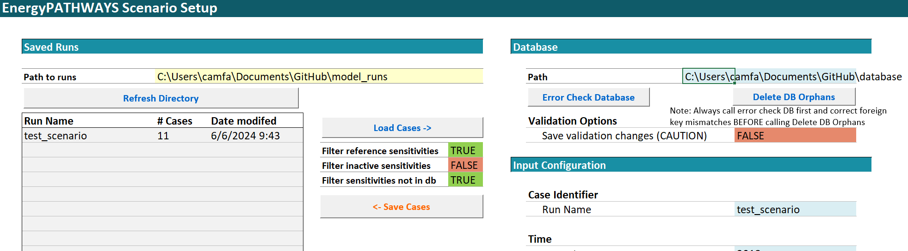
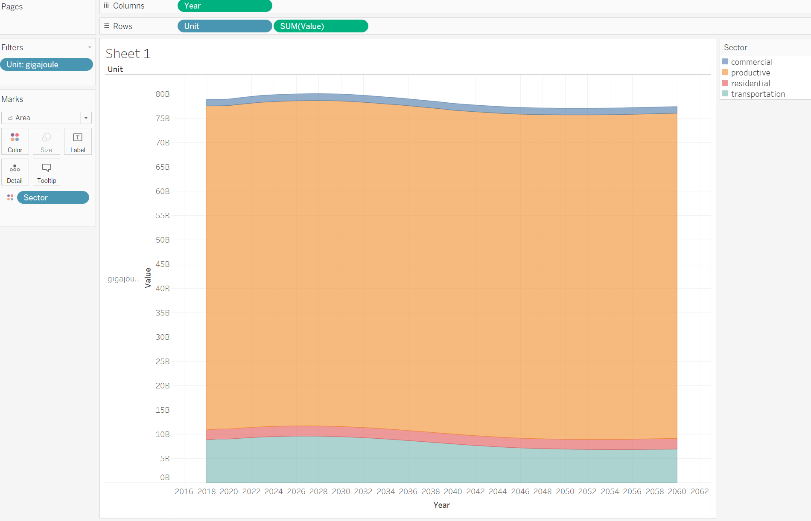

======================
Installation and Setup
======================

Installation and Test Run Instructions (Windows)
----------------------------------------------------

The following installation and test run instructions are for Windows
users of EnergyPATHWAYS. Mac use is possible but involves a different
setup and use of EP through the command prompt (as opposed to macro
functions in the scenariobuilder.xlsm). See
https://energypathways.readthedocs.io/en/latest/interface.html#run-energy-pathways-on-macos
for more information.

For a more detailed description and walkthrough of the EP Interface,
please take advantage of the videos posted on
https://energypathways.readthedocs.io/en/latest/interface.html.

1. Install the EnergyPathways Model

   a. Navigate to
      https://energypathways.readthedocs.io/en/latest/setup.html. Follow
      the main installation steps on the page (summarized in steps b-g
      below).

   b. Download the Anaconda (or miniconda) Distribution linked on the
      page.

   c. Clone the GitHub files.

      i.   Download the GitHub desktop app.

      ii.  Clone https://github.com/EvolvedEnergyResearch/EnergyPATHWAYS

      iii. Note: It is not recommended to download the .zip file and
           extract EP from there. It was unsuccessful for the group.
           Cloning was successful.

   d. Open the Anaconda Prompt app (found in Windows Search; may have to
      run as administrator).

   e. Change directory to the folder containing “environment.yml” using
      the “cd” command. For example, if the GitHub files were cloned
      into Documents, type::

      $ cd C:\\Users\\Username\\Documents\\GitHub\\EnergyPATHWAYS

f. Proceed with commands listed on website site (copied below)::

   $ cd EnergyPATHWAYS
   $ conda env create -f environment.yml
   $ conda activate ep
   $ pip install -e .

g. EnergyPathways is now installed.

h. Setup Interface

   i.   Go to the location where EnergyPATHWAYS is installed (where it
        was cloned to from GitHub). Copy the interface folder (EP
        interface) from the EP main folder to a new working directory
        (to keep the original copy preserved).

   ii.  Open scenario_builder.xlsm from copied EP interface folder.

   iii. Open xlwings.config tab of sheet. Ensure the following three
        lines match:

        1. *Interpreter_Win*: python

        2. *Conda Path*: C:\\Users\\Username\\anaconda3 (Note: This may
           be different depending on where anaconda3 is installed. See
           website for how to find folder location.)

        3. *Conda Env*: ep

2. Retrieve and Prepare Test Database

   a. Download the Australia test database from
      `Dropbox <https://www.dropbox.com/scl/fi/sffsvql1ks1l5tshwl5j5/Australia_EP_database.zip?rlkey=769o9b59byhoj5kelw4ae5hhs&e=2&dl=0>`__.
      
      **Reference:** Davis, Dominic, Andrew C. Pascale, Bishal Bharadaj, Richard Bolt, Michael Brear, Brendan Cullen, Robin Batterham, et al. Net Zero Australia - Slide Pack and Input Data (Updated Version). Data Collection. The University of Queensland, 2024. \https://doi.org/10.48610/e32f6e5.

   b. Put both folders (database and model_runs) into the new working
      directory (where the EP Interface copy from step h.i is).

   c. Open the model_runs folder. In test_scenario, open config.INI.
      Edit the fourth line to include the directory of the database
      folder.

      i. Example: database_path =
         C:\\Users\\Username\\Documents\\GitHub\\database

   d. Open the scenario_builder.xlsm sheet again.

   e. In the yellow box on the top left of **both** the cases and
      controls tab, put the model_runs folder directory.

   f. In the cases tab, under the “database” section, add the directory
      of the database folder to cell L6. (step may be unnecessary due to
      database directory specification in config.ini)

*Scenario builder cases tab. The yellow cell in the top left illustrates the cases tab change made in Step E. Make an identical change to the yellow cell in the controls tab.*

3. Disable RIO Export Process

   a. To avoid an edge case that may crash the program, disable the RIO
      export component of the code (this will also speed things up).
      Note that this is a temporary fix since the long-term goal for EP
      is to replace the RIO model export component with MACRO supply
      side model export capabilities. Make the fix by opening the file
      pathways_model.py and commenting out the following two lines of
      code:

      i.  Line 57: #export = ep2rio.RioExport(self)

      ii. Line 58: #export.write_all()

4. Load Cases into Model and Run

   a. In the cases tab, select “Refresh Directory” and let test_scenario
      appear in the run list (should have 11 cases). Then click on the
      test_scenario cell in the list and press “Load Cases” and let the
      data cells on the right-hand side of the sheet populate.

   b. Next, go the controls tab and select “Refresh.” In a similar
      fashion to before, test_scenario should appear in the list. Click
      on it again and select “Queue Selected Scenario.”

   c. Now, the different cases should appear in the “Case List.” Remove
      any that you do not want to run.

      i. Note: You might just want to run one case (e.g., reference) at
         first to make sure it can go through without error.

   d. Adjust the number of cores and command windows in the “Cases run
      controls” section to control performance. Then click “Start Runs.”
      This may take several hours.

5. Visualize Data

   a. At the conclusion of the run, select “Compile Finished Cases” to
      aggregate data and make it easier to examine.

   b. Download Tableau if you do not already have it and open one of the
      .csv files from the aggregated output folder (folder name:
      \_aggregate_ouputs_EP).

   c. Example: To look at energy, open d_energy.csv in Tableau. Can use
      area chart with a setup like that in Figure below to visualize by
      sector or energy type.

*Results for energy demand in the test database reference case, color coded by sector in Tableau.*
