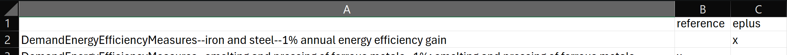
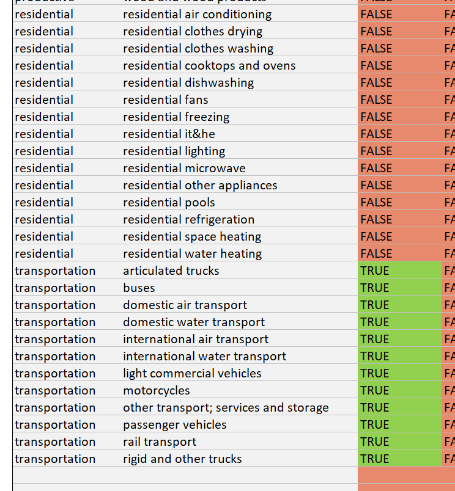

.. include:: ../.roles.rst

=================
Running the Model
=================

Scenario Builder
----------------

"scenario_builder.xlsm" is a macro-enabled spreadsheet that serves as the
main user interface for the EnergyPATHWAYS model. It simplifies the
running of the python model with user-friendly buttons and controls.
There are two main tabs: “controls” and “cases.”

-  Controls Tab: the controls tab allows the user to “control” different
   components of the run. This includes specifying processing power,
   which subsectors will be active or inactive, and which loaded cases
   will ultimately be run. The following steps outline the setup process
   for this sheet. They are also exemplified in steps 2-4 of Section
   :ref:`Installation and Setup`.

   i.   Paste the model_runs folder path into the yellow cell in the top
        left of the sheet.

   ii.  Click the “Refresh” button.

   iii. Select the cell with the desired scenario (e.g., test_scenario
        from the test Australia database) and click “Queue Selected
        Scenario.” Let the “Case List” populate with the different cases
        specified by this scenario. See the description of runs_key.csv
        in Section :ref:`Key Run Files` for an explanation of cases.

   iv.  Cases Control: Remove any unwanted cases from the Case List.

   v.   Performance Control: In “Cases run controls,” alter the number
        of cores (num_cores) and command window count (cmd_window_count)
        to control performance allocation. :red:`parallel_process can also be
        set to TRUE to run multiple processes in the model
        simultaneously (higher performance demand)`.

   vi.  Active/Inactive Subsectors Control: In the “Active Subsectors”
        section, change “Is active?” to TRUE or FALSE to enable or
        disable any subsectors in the run.

-  Cases Tab: The cases tab loads in the different user-designed cases
   run by the model. As discussed in Section :ref:`Key Run Files`, cases are different
   demand scenarios for the future (e.g., business-as-usual, rapid
   electrification, rapid efficiency improvements). The following steps
   outline the setup process for this sheet. They are also exemplified
   in steps 2-4 of Section :ref:`Installation and Setup`.

   i.   Paste the model_runs folder path into the yellow cell in the top
        left of the sheet.

   ii.  Click the “Refresh Directory” button.

   iii. Select the cell with the desired scenario (e.g., test_scenario
        from the test Australia database) and click “Load Cases.” The
        “Database” section of the sheet should populate with information
        from the config.ini file, discussed more in Section :ref:`Key Run Files`. Edit
        any information as necessary (e.g., can change current year here
        if different year was specified in the config.ini file). The
        right-hand side of the sheet should populate with case
        information from runs_key.csv, also discussed in Section :ref:`Key Run Files`.

-  Running: Return to the controls tab and select “Start Runs.” This
   will run the model. After the model is run, consider clicking
   “Compile finished cases” to aggregate data from different cases into
   one set of data sheets for easy viewing and comparing in Tableau. If
   data is not compiled, each case must be viewed individually from the
   output files in its folder (e.g., reference case output files are in
   “reference” folder of model_runs).

Key Run Files
-------------

The model_runs folder holds the “instructions” for running the model.
Within the model_runs folder, there are subfolders corresponding to each
scenario that can be loaded into the model and run. The test_scenario
folder from the Net Zero Australia Dropbox is one such example. In this
folder, there are three key files: logs, config.ini, and runs_keys.csv.

-  logs folder: The logs folder simply stores the command line outputs
   that are generated when running the model. These can be useful for
   recalling run times or error messages when the model crashes.

-  runs_key.csv: This file specifies the different “cases” that may be
   run by the model. Cases are different demand scenarios for the future
   (e.g., business-as-usual, rapid electrification, rapid efficiency
   improvements). The test database has 11 default cases. Each case can
   uniquely call on the user-induced measures placed in the database.
   The general format for such calls is: filename--subsector (or demand
   technology)--measure name.

   -  For example, if the user created a measure in
      DemandEnergyEfficiencyMeasures.csv for the “iron and steel”
      subsector titled “1% annual energy efficiency gain,” it can be
      called as featured in Row 2 of Figure below. Note that the “x” in
      column C (but not in column B) denotes that the measure is only
      considered in the “eplus” case. The reference case is run without
      the efficiency measure for comparison.

*Sample Energy Efficiency Measure in Runs Key.*

-  :red:`The user can also put in different data for the same piece of
   information, perhaps at different sensitives or under different
   assumptions. For example, two efficiency values – a high and a low –
   may be put in for a gasoline car. The default selection is indicated
   by a [d] in the *sensitivity* column of the dataset. To call a
   non-default value for a case, it has to be specified in the runs\_
   key.csv file, in a parallel manner to that shown in Figure above.`

-  config.ini: This text file contains the information that will
   populate the cases tab when the scenario is loaded into the
   scenario_builder.xlsm. It includes critical information like the
   database file path, performance metrics, time range of the model
   (e.g., start year, end year), and geography specification (e.g., what
   geography level is the model run at, default map key for scaling
   data). This file should be appropriately configured for each run. See
   summary of user-controlled contents below:

   -  DATABASE

      -  database_path: database file path on computer (e.g., "C:\\Users\\Username\\Documents\\EnergyPathways\\Net Zero Australia\\test_stock_decay_database\\database")

   -  CALCULATION_PARAMETERS (processing controls)

      -  parallel_process: control whether parallel process running is
         enabled or not (True or False)

      -  num_cores: specify number of cores to allocate from machine
         (e.g., 4)

      -  shape_check: check demand shapes when model runs (leave True)

   -  TIME (temporal controls)

      -  current_year: start year of model (e.g., 2023)

      -  end_year: simulate through this year (e.g., 2060)

      -  :red:`weather_years: same as current_year in Australia test database`

      -  dispatch_outputs_timezone: time zone of output temporal demand
         files (from list of time zones in time_zones.csv file installed
         from GitHub with EnergyPATHWAYS model)

   -  GEOGRAPHY

      -  default_geography_map_key: default map key (used to scale data
         across geographies if no map key is explicitly specified in
         data input files, e.g., population)

      -  :red:`demand_primary_geography: primary geography (what geography
         level is the model run at)`

      -  :red:`primary_subset (blank for Australia test database)`

      -  :red:`breakout_geography (blank for Australia test database)`

      -  :red:`include_foreign_gaus (True for Australia test database)`

      -  :red:`diag_geography (sa4 – smallest region – for Net Zero
         Australia)`

      -  :red:`disagg_breakout_geography (blank for Australia test database)`

   -  UNITS (output units)

      -  energy_unit: energy output unit (e.g., gigajoule)

      -  mass_unit: mass output unit (e.g., kilogram)

      -  currency_name: currency output name (e.g., AUD)

      -  currency_year: currency output year (e.g., 2023)

      -  inflation_rate: inflation rate of currency (e.g., 0.027 for
         Australia test database)

   -  DEMAND_OUTPUT_DETAIL

      -  :red:`dod_years_subset: blank for Australia test database`

      -  dod_vintage: track stock vintages in demand output (True or
         False)

      -  dod_demand_technology: track demand technologies in demand
         output (True or False)

      -  dod_cost_type: track cost type (e.g., capital, installation,
         etc.) in demand cost output (True or False)

      -  dod_new_replacement: track whether technology was new or
         replacement for decayed technology in demand output (True or
         False)

      -  dod_other_index_1: Track Other Index 1 (True or False)

      -  dod_other_index_2: Track Other Index 2 (True or False)

         -  See Section :ref:`OtherIndexes.csv` for more information on other indexes.

      -  dod_output_hourly_profiles: Output hourly demand profiles (True
         or False)

      -  dod_hourly_profile_final_energy_types: Control final-energy
         types that are reported on hourly profiles (e.g., electricity,
         pipeline gas; from list of final energy types specified in
         Section :ref:`FinalEnergy.csv`)

      -  dod_hourly_profile_years: Control which years are reported for
         hourly profiles (e.g., “2020, 2030, 2040, 2050, 2060” would
         report hourly annual profiles every 10 years through 2060)

      -  dod_hourly_profile_keep_subsector: Control whether hourly
         profiles are given on subsector level (True or False)

      -  dod_hourly_profile_keep_feeder: Control whether hourly profiles
         are given on dispatch feeder level (True or False; see Section
         :ref:`DispatchFeedersAllocation.csv` for more information on dispatch feeders)

   -  DEMAND_CALCULATION_PARAMETERS

      -  use_service_demand_modifiers: Enable service demand modifiers
         (“True or False”). If “False,” service demand is allocated to
         technologies in proportion to stock composition (e.g., if a
         technology makes up 50% of stock, it is allocated 50% of total
         service demand). If “True,” modifiers are weighting numbers
         that change the allocation procedure. For example, electric
         vehicles may be driven more than gasoline vehicles. The
         electric vehicle can be weighted higher such that, even if the
         EV stock is equivalent to gasoline vehicles, it meets more of
         the service demand. See `Net Zero America Annex
         A.2 <https://netzeroamerica.princeton.edu/img/NZA%20Annex%20A2%20-%20Technical%20appendix%20to%20EER%20report.pdf>`__\ *,
         2020, p. 49* for relevant equation and *p. 52-54* for more
         information on service demand modifiers.

      -  :red:`removed_demand_levels: blank for Australia test database`

   -  RIO and RIO_DB sections are excluded since RIO export component of
      EnergyPATHWAYS model is disabled (as per Section :ref:`Installation and Setup`).

   -  LOG

      -  :red:`log_level: type of information reported in log for a given run
         (available log levels are “CRITICAL”, “ERROR”, “WARNING”,
         “INFO”, or “DEBUG”)`

      -  :red:`stdout (True or False)`

Controlling Subsectors for Run
------------------------------

EnergyPATHWAYS has the capability to run a single sector or subsector at
a time. This allows users to test run subsectors as they are inputted
into the model to ensure appropriate input formatting and reasonable
results. It also cuts down on time if only a certain sector or
subsector’s data is desired for examination. To run a single sector or
subsector, open the “controls tab” and place “FALSE” under the “is
active?” column for all non-desired subsectors. For example, to run only
the transportation sector, disable all subsectors from the residential,
productive, and commercial sectors, as shown in Figure below.

*Controls tab subsector command window for run with only transportation sector.*
