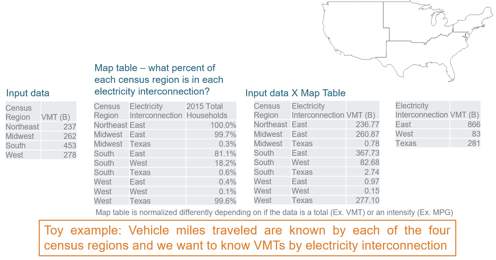
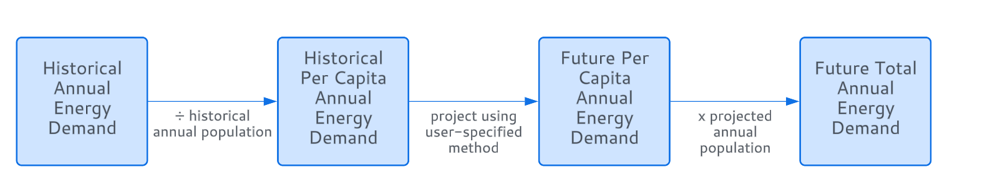
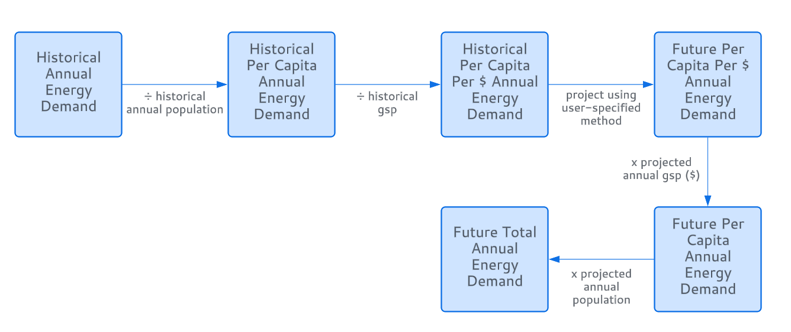

==========================
Input Database Methodology
==========================

At its core, the input database can be broken down into four fundamental
parts: geographies, drivers, subsectors, and temporal shapes.

Geographies
-----------

Geographies: EnergyPATHWAYS allows for data input and running on a
variety of geographical levels (country-wide, state-wide, city-wide,
regional, etc). Map keys are used to map data between these different
levels. Examples include population, number of households, land area,
and steel production. For instance, if iron and steel sector energy
demand is taken in on the national level, but the model is run on the
state level, the demand can be broken down by state in proportion to the
map key of steel production. All regions and map keys are outlined in
the spatial join table (GeographiesSpatialJoin.csv). See Figure below,
repurposed from the Evolved Energy Research EnergyPATHWAYS website, for
another example.

*Geography Rescaling Example*

*Here, VMTs known by census region are mapped to electricity
interconnection region according to fraction of households in the census
region that are in each electricity interconnection region.*

*Source: Evolved Energy Research EnergyPATHWAYS Website (Retrieved June
27, 2024)*

Demand Drivers
--------------

Demand drivers like population and gross state product are often
correlated with energy demand. The file DemandDrivers.csv allows for
historical and projected inputs of such drivers into the model.

*Single Driver Example*: Imagine we are projecting iron and steel energy
demand to 2060 and specify a driver of population. Historical annual
energy demand input for iron and steel will be divided by the population
input for each year. These per capita values will then be projected into
the future using the extrapolation method specified by the user (e.g.,
linear regression, exponential fit). Finally, the projected per capita
values to 2060 will be multiplied by the respective population
projection for each year to obtain a final-energy demand value. See
Figure below.

*Single Demand Driver Visual Example*

*Multiple Drivers Example*: Multiple drivers can be employed together in
a parallel manner. For each new driver, there is just an additional
division and multiplication step. The model divides by each driver,
projects forward, and then multiplies by each driver to get a total
energy demand. For instance, if the drivers of population *and* gsp
(gross state product) are specified, the model divides annual energy
demand values by both population and gsp, obtaining values in units of
energy per person per dollar. These values are then projected into the
future and multiplied by the future population and gsp projections to
obtain final-energy demand projections. See Figure below.

*Multiple Demand Driver Visual Example*

Subsector Data Input
--------------------

The EnergyPATHWAYS model groups data on two main levels: sectors and
subsectors. These can be defined by the user. Sectors are the primary
groupings of energy demand and are often analogous to the different
sectors of society. In the Net Zero Australia study, four sectors were
used: transportation, residential, productive (industry), and
commercial. Subsectors are the secondary groupings of energy demand and
are located within each sector. For instance, in the Net Zero Australia
study, the iron and steel industry was a subsector of the productive
sector.

After loading in geographic and demand driver data, as outlined in
Sections :ref:`Geographies` and :ref:`Demand Drivers`, the user can define the sectors and subsectors and
begin to input individual subsector data. The model can be run
independently for each subsector, so they can be tested as they are
added. Subsector modeling is done using one of four core methods: (the
first two being the most common)

1. **Energy Demand** (see `Net Zero America Annex
   A.2 <https://netzeroamerica.princeton.edu/img/NZA%20Annex%20A2%20-%20Technical%20appendix%20to%20EER%20report.pdf>`__\ *,
   2020, p. 56*)\ **:** This method is the simplest employed by the
   model. It is commonly used for the productive sector, where subsector
   stock and service demand data are limited. Instead, users can input
   direct historical energy demand by fuel type in
   DemandEnergyDemands.csv. Historical energy demand data are used with
   user specified drivers and growth methods to project energy demand
   into the future.

   a. Users can further influence projection with efficiency measures
      (e.g., 1% annual growth in energy efficiency) or fuel switching
      measures (e.g., push a transition from coal to hydrogen in iron
      and steel sector). See Sections :ref:`DemandEnergyEfficiencyMeasures.csv` to :ref:`DemandFuelSwitchingMeasuresImpact.csv` for details on the
      configuration of such measures.

2. **Stock and Service Demand** (see `Net Zero America Annex
   A.2 <https://netzeroamerica.princeton.edu/img/NZA%20Annex%20A2%20-%20Technical%20appendix%20to%20EER%20report.pdf>`__\ *,
   2020, p. 48-54*)\ **:** This method is the most explicit
   representation of energy demand in the model and requires the most
   amount of input data.

   a. The main data requirements include:

      1. Historical service demand data (e.g., passenger-km per year)
         input into the model and tied to relevant drivers in
         DemandServiceDemands.csv.

      2. Relevant technologies and efficiencies specified in files such
         as DemandTechs.csv. Each subsector using the Stock and Service
         Method has a set of user-inputted demand technologies that are
         used to meet the projected annual service demand. A demand
         technology can be defined as a technology that uses an energy
         carrier (e.g., electricity, coal) to meet a service demand
         (e.g., passenger-km). For example, in the passenger vehicles
         subsector, a light duty gasoline automobile and light duty
         electric vehicle are two examples of demand technologies.

      3. Initial technology stock specified in DemandStock.csv, with
         relevant sales measures specified in
         DemandSalesShareMeasures.csv. For an example of how sales share
         inputs are utilized, see `Net Zero America Annex
         A.2 <https://netzeroamerica.princeton.edu/img/NZA%20Annex%20A2%20-%20Technical%20appendix%20to%20EER%20report.pdf>`__\ *,
         2020, p. 50-52.*

   b. Method: The model uses initial stock and sales measures to perform
      rollover calculations and obtain the technology stock for each
      future year. Service demand is allocated to stock technologies.
      Using technology efficiency (e.g., mpg) and service demand, final
      energy demand is calculated.

3. **Stock and Energy Demand** (see `Net Zero America Annex
   A.2 <https://netzeroamerica.princeton.edu/img/NZA%20Annex%20A2%20-%20Technical%20appendix%20to%20EER%20report.pdf>`__\ *,
   2020, p. 54-55*)\ **:** This method accounts for subsectors where
   service demand data are not readily available, but technology stock
   and energy consumption data are. Instead, users can input direct
   energy demand and technology stock data, and the model will back
   solve for service demand and run in a similar method to Stock and
   Service.

   a. The main data requirements include:

      1. Historical annual energy demand data by demand technology input
         into DemandEnergyDemands.csv.

      2. Relevant technologies and efficiencies specified in files such
         as DemandTechs.csv and DemandTechsMainEfficiency.csv.

      3. Initial technology stock specified in DemandStock.csv, with
         relevant sales measures specified in
         DemandSalesShareMeasures.csv. For an example of how sales share
         inputs are utilized, see `Net Zero America Annex
         A.2 <https://netzeroamerica.princeton.edu/img/NZA%20Annex%20A2%20-%20Technical%20appendix%20to%20EER%20report.pdf>`__\ *,
         2020, p. 50-52.*

   b. Model Calculation Method:

      1. For each year that energy demand data is *explicitly* inputted
         into DemandEnergyDemands.csv, divide (or multiply, depending on
         units) by that year's technology efficiency (from
         DemandTechsMainEfficiency.csv) to obtain the service demand
         value for that year.

      2. Project service demand values into missing years using the
         interpolation and extrapolation methods specified in
         DemandEnergyDemands.csv.

      3. Run the "stock and service" method as usual to obtain energy
         demand projections.

4. **Service and Service Efficiency** (see `Net Zero America Annex
   A.2 <https://netzeroamerica.princeton.edu/img/NZA%20Annex%20A2%20-%20Technical%20appendix%20to%20EER%20report.pdf>`__\ *,
   2020, p. 55*)\ **:** This method accounts for subsectors that have
   service demand data but lack the technology or stock data necessary
   to perform a full rollover calculation. Instead, service efficiency
   terms are input into DemandServiceEfficiency.csv and, combined with
   service demands, allow for an energy demand calculation.

Temporal Shape Data Input
-------------------------

EnergyPATHWAYS has the capability to craft temporal (hourly) demand
curves for each energy carrier on the subsector level. The model can be
instructed to do this from the config.ini file discussed in Section :ref:`Key Run Files`,
where the user can specify which energy carriers to produce
subsector-level temporal energy demand curves for. Demand shapes are
based on input temporal shapes in the ShapeData folder of the database.
All shapes are listed in Shapes.csv (Section :ref:`Shapes.csv`). For example, the
file residential_electricity.csv contains residential electricity demand
for every hour of the year for different geographical regions.
Subsectors are assigned shapes in one of two ways:

1. **Subsector Level**: The user can specify a demand shape for an
   individual subsector in the "shape" column of DemandSubsectors.csv.
   The shape name is from the list in Shapes.csv (Section :ref:`Shapes.csv`). This
   shape will be used for ALL final-energy carriers' hourly profiles if
   generated. For example, if a shape is assigned to the iron and steel
   subsector, coal demand, electricity demand, and all other energy
   carriers’ temporal demand will follow this shape. When a shape is
   forced on the subsector level, there is an additional data field (in
   the shape csv file) known as the dispatch_feeder. The user must use
   DispatchFeedersAllocation.csv (Section :ref:`DispatchFeedersAllocation.csv`) to
   specify
   dispatch_feeder rates. This controls what proportion of the energy
   demand is met by each type of dispatch_feeder shape values. For
   instance, imagine the dispatch_feeder types are “productive” and
   “residential” in the passenger vehicle subsector’s shape. This means
   that separate shape data is available with the flag “productive” and
   “residential.” The user must use DispathFeedersAllocation.csv to
   control what proportion of the subsector’s shape is determined by the
   “productive” flagged data versus the “residential” flagged data (“1”
   means fully by one feeder; “0.5” and “0.5” means a 50-50 split,
   etc.).

2. **Sector Level**: If a subsector-specific shape is not specified,
   then it defaults to the sector level shape determined from
   DispatchFeedersAllocation.csv (Section :ref:`DispatchFeedersAllocation.csv`). Each sector is
   assigned a shape in the DemandSectors.csv file (e.g., Residential
   sector is assigned the shape residential_electricity from the list in
   Shapes.csv). In DispatchFeedersAllocation.csv, the user breaks down
   what proportion of energy in each subsector comes from each sector's
   shape. For example, the user can specify that, for the passenger
   vehicle subsector, 50% of the demand is met by the residential sector
   shape and 50% is met by the productive sector shape. The model will
   combine the two shape curves from those two sectors (which were
   specified in DemandSectors.csv) to produce one for the subsector. As
   in the first method, this shape will be used for all energy carriers
   in the subsector.