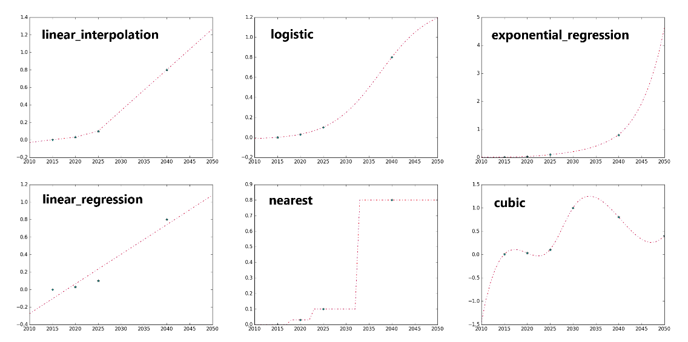

.. include:: ../.roles.rst

=======================================
Input Database Constituent File Details
=======================================

General Database File Structure
-------------------------------

The .csv files featured below collectively represent the EP input
database. Each file and its contents are explained in detail in Section
5.3. Section headers are included before file names for reference.

-  Geographies

   -  GeographiesSpatialJoin.csv

   -  Geographies.csv

   -  GeographiesMapKeys.csv

-  Drivers

   -  DemandDrivers.csv

-  Subsector Data Input: Energy Demand Method

   -  Demand Itself: DemandEnergyDemands.csv

   -  Energy Efficiency Measures (e.g., 1% annual efficiency growth)

      -  DemandEnergyEfficiencyMeasures.csv

      -  DemandEnergyEfficiencyMeasuresCost.csv

   -  Fuel Switching Measures (e.g., force a switch from gasoline to
      electricity)

      -  DemandFuelSwitchingMeasures.csv

      -  DemandFuelSwitchingMeasuresCost.csv

      -  DemandFuelSwitchingMeasuresEnergyIntensity.csv

      -  DemandFuelSwitchingMeasuresImpact.csv

-  Subsector Data Input: Stock and Service Method

   -  Service Demand

      -  DemandSerivceDemands.csv

      -  DemandServiceDemandMeasures.csv

      -  DemandServiceDemandMeasuresCost.csv

      -  DemandServiceEfficiency.csv

      -  DemandServiceLink.csv

   -  Technology Stock/Sales

      -  DemandStock.csv

      -  DemandStockMeasures.csv

      -  DemandSales.csv

      -  DemandSalesShareMeasures.csv

   -  Technology Details

      -  DemandTechs.csv

      -  DemandTechsAirPollution.csv

      -  DemandTechsAuxEfficiency.csv

      -  DemandTechsCapitalCost.csv

      -  DemandTechsFixedMaintenanceCost.csv

      -  DemandTechsFuelSwitchCost.csv

      -  DemandTechsIncentive.csv

      -  DemandTechsInstallationCost.csv

      -  DemandTechsMainEfficiency.csv

      -  DemandTechsParasiticEnergy.csv

      -  DemandTechsSerivceDemandModifier.csv

      -  DemandTechsServiceLink.csv

-  Energy Demand Temporal Patterns

   -  Shapes.csv

   -  ShapeData folder (energy demand temporal patterns)

      -  E.g., residential_electricity.csv contains residential
         electricity demand for every hour of the year for different
         geographical regions.

   -  DispatchFeedersAllocation.csv

-  Other

   -  DemandSectors.csv

   -  DemandSubsectors.csv

   -  FinalEnergy.csv

   -  CurrenciesConversion.csv

   -  InflationConversion.csv

   -  OtherIndexes.csv

Common Terms in Database Files
------------------------------

The following terms appear in multiple database files and are defined
here to avoid redundancy. Other terms that are uniquely used in only one
database file are defined in the section of this reposit where that file
is explicated.

-  *age_growth_or_decay_type*: This control allows quantities to grow or
   decay over the lifetime of a technology. For example, a vintage 2030
   gasoline car (a car that entered the technology stock in 2030) may
   experience a loss in efficiency as it ages. The initial efficiency
   value in 2030 < the value in 2031 < the value in 2032… The two
   options for this decay type are “linear” and “exponential.”
   Respective growth rates are specified in *age­_growth_or_decay*,
   described in the next term.

   -  It is important to understand that this control influences how a
      vintage of technology changes **across its lifetime**. For
      instance, in the efficiency example above, this control **does
      not** influence the efficiency of new gasoline cars sold over
      time. It only controls how the efficiency of a car added to the
      stock in year “x” changes as that vintage car enters year “x+1”,
      “x+2,” ... of its lifespan.

-  *age_growth_or_decay*: This control specifies the rate at which
   quantities change over the lifetime of the technology according to
   the “linear” or “exponential” function specified in
   *age_growth_or_decay_type*.

   -  If the “exponential” type is selected, this value is the yearly
      rate of change. For example, “0.01” indicates a growth of 1% each
      year. Similarly, “-0.01” indicates a decay of 1% each year.

   -  If the “linear” type is selected, this value is what portion of
      the initial value the function increases or decreases by each
      year. For example, a value of “0.01” indicates that the quantity
      increases linearly by 1% of the initial value each year. If the
      initial efficiency value is 10 miles per gallon and a value of
      “0.01” is selected, the efficiency value would linearly increase
      by 0.01 x 10 = 0.1 miles per gallon each year.

-  *cost_denominator_unit*: cost is in $/x. What is x? (e.g., GJ for
   gigajoules)

-  *cost_of_capital*: Weighted Average Cost of Capital (WACC) (in
   decimal value)

-  *demand_technology*: a technology that uses energy to provide a
   service (e.g., an electric vehicle, a gasoline vehicle, a
   refrigerator, a heat pump, etc.)

-  *driver_1*

-  *driver_2*

-  *driver_3*

   -  Relevant drivers (if any) for projections, as explained in Section
      4.2.

-  *driver_denominator_1*

-  *driver_denominator_2*

   -  indicates the driver that a data input has been normalized by. For
      example, light duty vehicle service demand may be input as annual
      vehicle miles traveled per person. In this case, the driver
      denominator would be ‘population’.

-  *extrapolation_method*: method used to extrapolate data beyond range
   of years explicitly defined in the database. (same input options as
   *interpolation_method*, featured below)

-  *extrapolation_growth*: if (and only if) the
   “exponential_interpolation” method is specified in
   *extrapolation_method,* the user can specify a growth rate for
   extrapolated values here. For example, putting 0.01 for
   *extrapolation_growth* will force a 1% increase in extrapolated
   values each year. Otherwise, the interpolated curve from the previous
   two data points will be projected forward to obtain extrapolated
   values.

-  *final_energy*: final-energy type of data input (any from list in
   FinalEnergy.csv – see Section :ref:`FinalEnergy.csv`)

-  *gau*: ‘geographical analysis unit’ – references a single zone within
   a *geography* category.

   -  E.g., Within a *geography* of “state,” each individual state
      (e.g., “new jersey”) is a *gau*.

   -  There is a special hardcoded *geography-gau* pair of “global”
      (*geography*) and “all” (*gau*) used for data inputs that cover
      all geographical regions (e.g., national level data for
      Australia).

-  *geography*: geographical category of data input (e.g., state,
   province, city)

-  *geography_map_key*: used to upscale or downscale data inputs between
   geographies.

   -  E.g., if iron and steel sector energy demand is taken in on the
      national level, but the model is run on the state level, the
      demand may be broken down by state in proportion to the map key of
      steel production. See additional discussion in Section :ref:`Geographies`.

-  *input_type*: specifies that input data is an “intensity” or “total”
   value. (these are the only two options)

   -  E.g., is the data for all people (total) or per person
      (intensity)?

-  *interpolation_method*: method used to interpolate data between given
   years (e.g., if data is given for 2030 and 2040, how do we get data
   for 2035?) See list of options below. Figure below offers a visual
   description for several of the methods.

   -  *linear_interpolation*: Adjacent data points are connected with a
      line to generate missing data.

   -  *linear_regression*: A line of best fit is generated from all
      provided data points. Original data are replaced with data along
      this line. Missing data are found from this line. (i.e., all data
      is along a line of best fit)

   -  *logistic*: Fits an s-curve function to the provided data points.
      Original data are replaced with data along this curve, and missing
      data are found from the curve.

   -  *cubic*: Fits a cubic spline to the provided data points using the
      scipy library. The spline contains all the provided data points,
      and missing data are found along the spline.

   -  *quadratic*: Fits a quadratic spline to the provided data points
      using the scipy library. The spline contains all provided data
      points, and missing data are found along the spline.

   -  *nearest*: Missing data are filled to be equal to the nearest
      provided data point.

   -  *exponential_interpolation*: Adjacent data points are connected
      with an exponential curve to generate missing data, similar to how
      linear interpolation works but exponential curves instead of
      straight lines. In extrapolation, there is no final point to
      connect a curve to. The model will use the previous curve (from
      the previous two points) and project it forward unless an
      exponential growth rate is given in the *extrapolation_growth*
      column. A value of 0.01 given in the *extrapolation_growth* column
      forces 1% annual growth in extrapolated values.

   -  *exponential_regression*: Creates a best fit exponential curve for
      all the provided data points using the polyfit function. Original
      data are replaced with data along this curve. Missing data are
      found from the curve.

   -  *average*: replaces provided values with a mean (flat line at mean
      value).

   -  *decay_towards_linear_regression*: Only an option for
      extrapolation. After the final provided data point, values
      approach the line of best fit (the same line used in
      linear_regression method).

   -  *forward_fill*: missing years are made equal to the closest
      historical year.

   -  *back_fill*: missing years are made equal to the closest future
      year.

*Graphical example of several interpolation/extrapolation methods. Provided data points are blue stars. Source: EnergyPATHWAYS Model Website.*

-  *is_levelized*: is the capital cost annualized? (TRUE/FALSE)

-  *is_stock_dependent*: is total service demand dependent on size of
   stock? (TRUE or FALSE)

-  *lifetime_variance:* variance in lifetime of a technology in years

   -  Note: user must either specify min and max lifetime *or* mean and
      variance

-  *max_lifetime:* maximum lifetime of technology in years

   -  Note: user must either specify min and max lifetime *or* mean and
      variance

-  *mean_lifetime:* mean lifetime of technology in years

   -  Note: user must either specify min and max lifetime *or* mean and
      variance

-  *min­_lifetime:* minimum lifetime of technology in years

   -  Note: user must either specify min and max lifetime *or* mean and
      variance

-  *notes*: user notes to document assumptions (not used for
   computations in model)

-  *other_index_1*

-  *other_index_2*

   -  Optional additional index categories to maintain during
      calculations, e.g., in the residential sector, building type can
      be an additional level of grouping data and viewing results.

   -  See the description of OtherIndexes.csv (Section :ref:`OtherIndexes.csv`) for more
      information on other indexes.

-  *oth_1:* one element from the *other_index_1* category. Ex. If
   *other_index_1* is ‘building_type’, *oth_1* may be ‘detached single
   family’.

-  *oth_2*: analogous to *oth_1* for *other_index_2*

-  *sector*: main groupings of energy consumption (e.g., in Net Zero
   Australia, these are productive, commercial, residential, and
   transportation)

-  *sensitivity:* sensitivity tag for the data input

   -  E.g., for 2040 population, may have a high, medium, and low
      estimate depending on sensitivity (“low”, “medium [d]”, “high”)

   -  [d] indicates default option for model to select (if not specified
      in runs_key file)

-  *shape*: hourly shape of the service demand for a sector, subsector,
   or technology

   -  e.g., commercial_electricity, industry_electricity (productive
      sector), residential_elecricity

-  *source*: where the data/information came from (not used in model
   calculations)

-  *stock_decay_function:* models the rate at which vintaged stock
   decays and needs to be replaced. Three options are “linear,”
   “exponential,” and “weibull.” See Section :ref:`Stock Rollover Calculation` for more information on
   the stock rollover calculations.

-  *subsector*: sub-groupings of energy consumption (e.g., in Net Zero
   Australia, subsectors of the productive sector are specific
   industries, like the iron and steel industry).

-  *vintage*: sales year of technology

Database File-by-File Details
-----------------------------

This section explores every database file, its purpose, and contents.
Column headers without a description are featured as common terms in
Section :ref:`Common Terms in Database Files`.

GeographiesSpatialJoin.csv
~~~~~~~~~~~~~~~~~~~~~~~~~~

Purpose: Fundamental geography table. Indicates relevant geography types
(*geography*), names (*gau*), time zones, and map keys to scale data
between different granularities.

Figure below depicts a sample spatial join table for a preliminary China
study. The column headers circled in red are the geography types
(*geography*). In this case, data is only input on the national or
provincial level. The analysis units (*gau*) associated with each type
are listed below the headers. These include each individual province as
well as the country as a whole (“china”). The column headers circled in
blue are map keys (e.g., population, land area, occupied dwellings,
steel production) with values for each region listed below them. Time
zones are chosen from the time_zones.csv file that was installed from
GitHub with the EnergyPATHWAYS model. It is featured in the
energyPATHWAYS folder of the installation.

*Sample geography spatial join table for a China study. Geography types are circled in red. Geography map keys are circled in blue.*

Geographies.csv
~~~~~~~~~~~~~~~

Purpose: List relevant geographic types (*geography*) and regions
(*gau*) for use in the database and model run.

Column Breakdown:

A. *geography*

B. *gau*

GeographyMapKeys.csv
~~~~~~~~~~~~~~~~~~~~

Purpose: List relevant geography map keys for scaling data cross
granularities.

Column Breakdown:

A. *name*: map key name (e.g., steel production 2023)

DemandDrivers.csv
~~~~~~~~~~~~~~~~~

Purpose: factors used to project energy and service demands over time.
E.g., population, gross domestic product, square footage of commercial
building types, vehicle miles traveled.

Column Breakdown:

A. *name*: driver name

B. *base driver*: is the driver specified in column A tied to a more
   fundamental driver?

   i. E.g., a driver of households may have a base driver of population.
      To project household size into the future, the method explained in
      Section :ref:`Demand Drivers` will be used, with the driver being population.

C. *input_type*

D. *unit_prefix*: value of a single unit

   i. E.g., does a value of “1” represent 1 person, 2 people, 3 people?

E. *unit_base*: what is the unit in question?

   i. E.g., people, households, square meters of floor

F. *geography*

G. *other_index_1*

H. *other_index_2*

I. *geography_map_key*

J. *interpolation_method*

K. *extrapolation_method*

L. *extrapolation_growth*

M. *source*

N. *notes*

O. *gau*

P. *oth_1*

Q. *oth_2*

R. *year*: year of data input

S. *value*: demand driver value (in relative or absolute units, as
   specified in Columns C-E)

   i. E.g., annual population value

T. *sensitivity*

DemandEnergyDemands.csv
~~~~~~~~~~~~~~~~~~~~~~~

Purpose: Accounts for energy demand in subsectors without enough
information for a stock/service demand calculation.

Column Breakdown:

A. *subsector*

B. *is_stock_dependent*

C. *input_type*

D. *unit*

E. *driver_denominator_1*

F. *driver_denominator_2*

G. *driver_1*

H. *driver_2*

I. *driver_3*

J. *geography*

K. :red-italic:`final_energy_index:` :red:`generally blank but unsure of exact purpose`

L. :red-italic:`demand_technology_index:` :red:`generally blank but unsure of exact purpose`

M. *other_index_1*

N. *other_index_2*

O. *interpolation_method*

P. *extrapolation_method*

Q. *extrapolation_growth*

R. *geography_map_key*

S. *source*

T. *notes*

U. *gau*

V. *oth_1*

W. *oth_2*

X. *final_energy*

Y. *demand_technology*

Z. *year*

A. *value*: energy demand value for subsector (Column A), year (Column
   Z), and energy type (Column X) specified

..

   AB. *sensitivity*

DemandEnergyEfficiencyMeasures.csv
~~~~~~~~~~~~~~~~~~~~~~~~~~~~~~~~~~

Purpose: Allows user to change energy efficiency over time for
subsectors that run with the simple energy demand method (those in
DemandEnergyDemands.csv).

Column Breakdown:

A. *name:* measure name (a specific name like “DDP: food; beverages and
   tobacco” is helpful for understanding what is represented; DDP stands
   for “Deep Decarbonization Pathway” as opposed to REF which stands for
   “Reference.”)

B. *subsector*

C. *input_type*: efficiencies are always an intensity

D. *unit*: energy efficiencies are generally unitless (blank box)

E. *geography*

F. *other_index_1*

G. *other_index_2*

H. *interpolation_method*

I. *extrapolation_method*

J. *extrapolation_growth*

K. *stock_decay_function*: not used/outdated

L. *min­_lifetime*: not used/outdated

M. *max_lifetime*: not used/outdated

N. *mean_lifetime*: not used/outdated

O. *lifetime_variance*: not used/outdated

P. *source*

Q. *notes*

R. *final_energy*

S. *gau*

T. *oth_1*.

U. *oth_2*

V. *year*

W. *value*: energy efficiency gain by year specified. For example, a
   typical value is 0.310550914 in 2060 and 0 in 2023. This represents
   1% annual efficiency gain from 2023 to 2060, since
   1-0.99\ :sup:`2060-2023` = 0.310550914. The *interpolation­_method* is
   used to fill in values for the intermediate years.

DemandEnergyEfficiencyMeasuresCost.csv
~~~~~~~~~~~~~~~~~~~~~~~~~~~~~~~~~~~~~~

Purpose: Specification of the cost of induced efficiency improvement
measures specified in DemandEnergyEfficiencyMeasures.csv.

Column Breakdown:

A. *parent*: measure name (from DemandEnergyEfficiencyMeausures.csv)

B. *currency*

C. *currency_year*

D. *cost_denominator_unit*

E. *cost_of_capital*

F. *is_levelized*

G. *geography*

H. *other_index_1*

I. *other_index_2*

J. *interpolation_method*

K. *extrapolation_method*

L. *extrapolation_growth*

M. *source*

N. *notes*

O. *gau*

P. *oth_1*

Q. *oth_2*

R. *vintage*

S. *value*: cost of induced efficiency improvement measure in units of
   *currency*/*cost_denominator_unit* (e.g., 10 $/GJ)

T. *final_energy*: (empty for NZAu)

DemandFuelSwitchingMeasures.csv
~~~~~~~~~~~~~~~~~~~~~~~~~~~~~~~

Purpose: Allows user to control energy type (ex. force a transition from
coal to electricity) in sectors that run with the simple energy demand
method (those in DemandEnergyDemands.csv).

Column Breakdown:

A. *name:* measure name (a specific name like “DDP: food; beverages and
   tobacco” is helpful for understanding what is represented; DDP stands
   for “Deep Decarbonization Pathway” as opposed to REF which stands for
   “Reference.”)

B. *subsector*

C. *final_energy_from*: original energy type (e.g., diesel)

D. *final_energy_to*: new energy type (e.g., electricity)

E. *stock_decay_function*

F. *min­_lifetime*

G. *max_lifetime*

H. *mean_lifetime*

I. *lifetime_variance*

DemandFuelSwitchingMeasuresCost.csv
~~~~~~~~~~~~~~~~~~~~~~~~~~~~~~~~~~~

Purpose: Incorporate cost of fuel switching measures specified in
DemandFuelSwitchingMeasures.csv.

Column Breakdown:

A. *parent*: measure name (from DemandFuelSwitchingMeasures.csv)

B. *currency*

C. *currency_year*

D. *cost_denominator_unit*

E. *cost_of_capital*

F. *is_levelized*

G. *geography*

H. *other_index_1*

I. *other_index_2*

J. *interpolation_method*

K. *extrapolation_method*

L. *extrapolation_growth*:

M. *source*

N. *notes*

O. *gau*

P. *oth_1*

Q. *oth_2*

R. *vintage*

S. *value*: cost of fuel switching measure in units of
   *currency*/*cost_denominator_unit* (e.g., 10 $/GJ)

DemandFuelSwitchingMeasuresEnergyIntensity.csv
~~~~~~~~~~~~~~~~~~~~~~~~~~~~~~~~~~~~~~~~~~~~~~

Purpose: Specify change in energy intensity as a result of fuel
switching measures specified in DemandFuelSwitchingMeasures.csv.

Column Breakdown:

A. *parent*: measure name (from DemandFuelSwitchingMeasures.csv)

B. *geography*

C. *other_index_1*

D. *other_index_2*

E. *interpolation_method*

F. *extrapolation_method*

G. *extrapolation_growth*

H. *source*

I. *notes*

J. *gau*

K. *oth_1*

L. *oth_2*

M. *year*

N. *value*: new energy intensity (relative to original fuel). For
   example, 0.5 indicates that total energy demand for this
   process/subsector dropped by 50% as a result of switching fuels. This
   could represent switching from coal blast furnaces to electric arc
   furnaces (EAFs) in the iron and steel sector, since EAFs consume less
   energy to produce the same amount of steel.

DemandFuelSwitchingMeasuresImpact.csv
~~~~~~~~~~~~~~~~~~~~~~~~~~~~~~~~~~~~~

Purpose: Allow users to control rate at which fuel switching measures in
DemandFuelSwitchingMeasures.csv occur.

Column Breakdown:

A. *parent*: measure name (from DemandFuelSwitchingMeasures.csv)

B. *input_type*: intensities are always an intensity

C. *unit*: intensities are generally unitless (blank box)

D. *geography*

E. *other_index_1*

F. *other_index_2*

G. *interpolation_method*

H. *extrapolation_method*

I. *extrapolation_growth*

J. *source*

K. *notes*

L. *gau*

M. *oth_1*

N. *oth_2*

O. *year*

P. *value*: what proportion of old fuel has been replaced by new fuel in
   year specified

   i. Ex. 0 indicates no replacement. 0.5 indicates 50% replacement of
      old fuel use with new fuel. 1 indicates full replacement of old
      fuel use with new fuel.

DemandServiceDemands.csv
~~~~~~~~~~~~~~~~~~~~~~~~

Purpose: Outline annual service demands and projection methods.

Column Breakdown:

A. *subsector*

B. *is_stock_dependent*

C. *input_type*

D. *unit*: demand unit, e.g., available_seat_kilometer

E. *driver_denominator_1*

F. *driver_denominator_2*

G. *driver_1*

H. *driver_2*

I. *driver_3*

J. *geography*

K. :red-italic:`final_energy_index:` :red:`generally blank but unsure of exact purpose`

L. :red-italic:`demand_technology_index:` :red:`generally blank but unsure of exact purpose`

M. *other_index_1*

N. *other_index_2*

O. *interpolation_method*

P. *extrapolation_method*

Q. *extrapolation_growth*

R. *geography_map_key*

S. *source*

T. *notes*

U. *gau*

V. *final_energy*

W. *demand_technology*

X. *oth_1*

Y. *oth_2*

Z. *year*

A. *value*: service demand value

*AB. sensitivity*

DemandServiceDemandMeasures.csv
~~~~~~~~~~~~~~~~~~~~~~~~~~~~~~~

Purpose: Allow user to alter the projection of service demand in a
subsector. For example, if we project a 25% decline in vehicle miles
traveled, we could enter that as a measure here.

Column Breakdown:

A. *name*: measure name (user is recommended to use informative name
   like “DDP_lowdemand: commercial air conditioning”)

B. *subsector*

C. *input_type*

D. *unit*

E. *geography*

F. *other_index_1*

G. *other_index_2*

H. *interpolation_method*

I. *extrapolation_method*

J. *extrapolation_growth*

K. *stock_decay_function*: not used/outdated

L. *min­_lifetime*: not used/outdated

M. *max_lifetime*: not used/outdated

N. *mean_lifetime*: not used/outdated

O. *lifetime_variance*: not used/outdated

P. *geography_map_key*

   i. Blank for NZAu

Q. *source*

R. *notes*

S. *gau*

T. *oth_1*

U. *oth_2*

V. *year*

W. value: relative service demand growth (relative to 2020 baseline (0)
   in Australia)

   i. e.g., value of 0.2 in 2050 and 0 in 2020 indicates a 20%
      **decline** in service demand from 2020-2050.

DemandServiceDemandMeasuresCost.csv
~~~~~~~~~~~~~~~~~~~~~~~~~~~~~~~~~~~

Purpose: Incorporate cost of service demand measures specified in
DemandServiceDemandMeasures.csv.

Column Breakdown: \*Note: Empty spreadsheet for NZAu

A. *parent*: relevant service measure

B. *currency*

C. *currency_year*

D. *cost_denominator_unit*

E. *cost_of_capital*

F. *is_levelized*

G. *geography*

H. *other_index_1*

I. *other_index_2*

J. *interpolation_method*

K. *extrapolation_method*

L. *extrapolation_growth*

M. *source*

N. *notes*

O. *gau*

P. *oth_1*

Q. *oth_2*

R. *vintage*

S. *value*: cost of service demand measure in units of
   *currency*/*cost_denominator_unit* (e.g., $/km)

DemandServiceEfficiency.csv
~~~~~~~~~~~~~~~~~~~~~~~~~~~

Purpose: Allows for input of service efficiency for subsectors that run
on the Service Demand and Efficiency method (when not enough information
available for full stock rollover calculation).

Column Breakdown:

A. *subsector*: only used for “cement CO2 capture” for NZAu

B. *energy_unit*: ex. mmbtu

C. *denominator_unit*: ex. tonne (mmbtu/tonne overall unit)

D. *geography*

E. *other_index_1*

F. *other_index_2*

G. *interpolation_method*

H. *extrapolation_method*

I. *extrapolation_growth*

J. *geography_map_key*

K. *source*

L. *notes*

M. *final_energy*

N. *gau*

O. *oth_1*

P. *oth_2*

Q. *year*

R. *value*: service efficiency in units of
   *energy_unit*/*denominator_unit* (e.g., J/km)

S. *sensitivity*

DemandServiceLink.csv
~~~~~~~~~~~~~~~~~~~~~

Purpose: Specify relationships in service demand between subsectors. For
example, the user can control what percentage of hot water service
demand comes from clothes washing. Thus, if service demand for clothes
washing drops, hot water service demand also drops according to the
service demand ratio.

Column Breakdown:

A. *name*: user-created name of service demand linkage (e.g.,
   “dem_svc_link_1”, “dem_svc_link_2,” …)

B. *subsector*: affecting subsector (e.g., if clothes washing
   contributes to hot water demand, clothes washing would be the
   affecting subsector since it affects hot water demand)

C. *linked_subsector:* affected subsector (e.g., if clothes washing
   contributes to hot water demand, hot water would be the affected
   subsector since its service demand was impacted by clothes washing
   service demand.)

D. *service_demand_share:* Value is ratio of shared service demand. For
   example, If the subsector is “residential clothes washing” and the
   linked subsector is “residential water heating,” a value of “0.25”
   specifies that 25% of hot water demand is from clothes washing. So,
   if clothes washing goes down 100% in service demand (is eliminated),
   hot water service demand drops 25%.

E. *year*

DemandStock.csv
~~~~~~~~~~~~~~~

Purpose: Define stock of technologies for each subsector.

Column Breakdown:

A. *subsector*

B. *is_stock_dependent*

C. *driver_denominator_1*

D. *driver_denominator_2*

E. *driver_1*

F. *driver_2*

G. *driver_3*

H. *geography*: geographical category of data input

I. *other_index_1*

J. *other_index_2*

K. *geography_map_key*

L. *input_type*

M. *demand_stock_unit_type: unit type (generally "equipment")*

N. *unit*: stock unit (ex. truck)

O. :red-italic:`time_unit:` :red:`if time is relevant to stock unit`

P. *interpolation_method*

Q. *extrapolation_method*

R. *extrapolation_growth*

S. *specify_stocks_past_current_year*: do you want to specify stock past
   the current year? (ex. specify 2050 stock breakdown) (TRUE/FALSE)

T. *source*

U. *notes*

V. *gau*

W. *oth_1*

X. *oth_2*

Y. *demand_technology*

Z. *year*

A. *value*: stock quantity

*AB. sensitivity*

DemandStockMeasures.csv
~~~~~~~~~~~~~~~~~~~~~~~

:red:`Purpose: Allows user to directly control stock composition (as opposed
to sales measures) (only used for “2017 AEO Res Distillate Boiler” in
NZAu)`

Column Breakdown:

A. *name*: technology name

B. *subsector*

C. *geography*

D. *other_index1*

E. *demand_technology*

F. *interpolation_method*

G. *extrapolation_method*

H. *extrapolation_growth*

I. *source*

J. *notes*

K. *gau*

L. *oth_1*

M. *year*

N. *value*: stock size in year specified :red:`(only zeros used in NZAu)`

DemandSales.csv
~~~~~~~~~~~~~~~

Purpose: :red:`If there are no technological classifications of historical
stock data, the model will not know how to replace decayed technology in
the baseline rollover (the rollover without the use of any sales share
measures). An input to DemandSales.csv specifies this baseline rollover
rate.`

Column Breakdown:

A. *subsector*

B. *geography*

C. *other_index_1*

D. *other_index_2*

E. *input_type*

F. *interpolation_method*

G. *extrapolation_method*

H. *extrapolation_growth*

I. *source*

J. *notes*

K. *gau*

L. *oth_1*

M. *oth_2*

N. *demand_technology*

O. *vintage*

P. *value*: proportion of sales made up by *demand­_technology* (Column
   N) in vintage year (Column O).

Q. *sensitivity*

DemandSalesShareMeasures.csv
~~~~~~~~~~~~~~~~~~~~~~~~~~~~

Purpose: Directly control sales rates in a certain year (e.g., can
specify what percent of cars sold in 2050 are EVs) to influence stock.

Column Breakdown:

A. *name*: measure name (a descriptive name is helpful. For example,
   “REF: CFL Exterior -> Incandescent Exterior” is referring to the
   replacement rate of decayed incandescent exterior lights with new CFL
   exterior lights in the reference case.)

B. *subsector*

C. *geography*

D. *other_index_1*

E. *demand_technology*: new technology

   i. e.g., CFL Exterior for example in A

F. *replaced_demand_tech*: technology that decayed and will be replaced
   by *demand_technology*

   i. e.g., Incandescent Exterior for example in A

G. *input_type*

H. *interpolation_method*

I. *extrapolation_method*

J. *extrapolation_growth*

K. *source*

L. *notes*

M. *gau*

N. *oth_1*

O. *vintage*

P. *value:* what proportion of sales in subsector are for
   *demand_technology*? If replacing, what proportion of
   *replaced_demand_tech* should be replaced by *demand_technology* upon
   decay in stock rollover?

DemandTechs.csv
~~~~~~~~~~~~~~~

Purpose: Specify relevant demand technologies for the model. A demand
technology is a device that uses energy to meet a service demand.

Column Breakdown:

A. *name*: relevant technology (e.g., Electric Transit Bus)

B. :red-italic:`linked:` :red:`technology that the current technology is linked to. For
   example, a heat pump that provides heating is also linked to a heat
   pump that provides cooling.`

C. :red-italic:`stock_link_ratio:` :red:`controls ratio of stock between linked
   technologies`

D. *subsector*

E. *source*

F. *additional_description:* user notes (not used by model)

G. *demand_tech_unit_type*: technology unit type (only “equipment” used
   in NZAu)

H. *unit*: technology unit (e.g., bus, truck, motorcycle)

I. :red-italic:`time_unit:` :red:`time unit if relevant (blank for NZAu)`

J. *cost_of_capital*

K. *stock_decay_function*

L. *min_lifetime*

M. *max_lifetime*

N. *mean_lifetime*

O. *lifetime_variance*

P. *shape*

DemandTechsAirPollution.csv
~~~~~~~~~~~~~~~~~~~~~~~~~~~

Purpose: Specify air pollutant emissions for technologies listed in
DemandTechs.csv.

Column Breakdown:

A. *demand_technology*

B. *definition*: is the value “absolute” or “relative” to another demand
   technology

C. *reference_tech*: reference technology (if *definition* is relative)

D. *mass_unit*: unit of mass for pollutant ex. kilogram

E. *energy_unit*: ex. mmbtu

F. *geography*

G. *other_index1*: “air pollution” for this data sheet

H. *other_index2*: blank for this sheet

I. *interpolation_method*

J. *extrapolation_method*

K. *extrapolation_growth*

L. *source*

M. *notes*

N. *gau*

O. *oth_1*: specific pollutant for this data row (ex. Nox, PM2.5, Sox)

P. *oth_2*: blank for this sheet

Q. *final_energy*

R. *vintage*

S. *year*

T. *value*: pollutant value in units of mass_unit/energy_unit (ex. 0.35
   kg Nox/mmbtu for gasoline LDV vintage 1960 in 1990 Australia)

U. *sensitivity*

DemandTechsCapitalCost.csv
~~~~~~~~~~~~~~~~~~~~~~~~~~

Purpose: Specification of capital costs for demand technologies listed
in DemandTechs.csv.

Column Breakdown:

A. *demand_technology*

B. *definition*: absolute or relative

   a. If “relative” definition, specify a reference technology in column
      C and a conversion operation in column M. For example, an
      operation of “multiply” in column M will multiply the reference
      technology’s value by the relative value in column U to obtain
      this technology’s absolute value.

C. *reference_tech*

D. *geography*

E. *other_index_1*

F. *other_index_2*

G. *currency*

H. *currency_year*

I. *is_levelized*

J. *interpolation_method*

K. *extrapolation_method*

L. *extrapolation_growth*

M. *reference_tech_operation*: only “multiply” used in NZAu.

N. *source*

O. *notes*

P. *new_or_replacement*: is technology cost in column U for a “new”
   installation or “replacement” for a decayed technology? (replacements
   may have lower costs)

Q. *gau*

R. *oth_1*

S. *oth_2*

T. *vintage*

U. *value*: see note under B for specifics on relative value (relative
   to specified reference technology by operation specified in M)

V. *sensitivity*

DemandTechFixedMaintenanceCost.csv
~~~~~~~~~~~~~~~~~~~~~~~~~~~~~~~~~~

Purpose: Specification of maintenance costs for demand technologies
listed in DemandTechs.csv.

Column Breakdown:

A. *demand_technology*

B. *definition*: “absolute” or “relative” (relative to reference
   technology in column C)

C. *reference_tech*

D. *geography*

E. *other_index_1*

F. *other_index_2*

G. *currency*

H. *currency_year*

I. *interpolation_method*

J. *extrapolation_method*

K. *extrapolation_growth*

L. *age_growth_or_decay_type*

M. *age_growth_or_decay*

N. *additional_description*: same as *notes*

O. *source*

P. *notes*

Q. *gau*

R. *oth_1*

S. *oth_2*

T. *vintage*

U. *value*: cost value in absolute units or relative to reference
   technology, as specified by Column B

V. *sensitivity*

DemandTechsFuelSwitchCost.csv
~~~~~~~~~~~~~~~~~~~~~~~~~~~~~

Purpose: Specification of fuel switching costs for demand technologies
listed in DemandTechs.csv.

Column Breakdown:

A. *demand_technology*

B. *definition*: absolute or relative (to reference technology specified
   in column C)

C. *reference_tech*

D. *geography*

E. *other_index_1*

F. *other_index_2*

G. *currency*

H. *currency_year*

I. *is_levelized*

J. *interpolation_method*

K. *extrapolation_method*

L. *extrapolation_growth*

M. *source*

N. *notes*

O. *gau*

P. *oth_1*

Q. *oth_2*

R. *vintage*

S. *value*: fuel switch cost in absolute units or relative to reference
   tech, as specified in Column B

T. *sensitivity*

DemandTechsIncentive.csv
~~~~~~~~~~~~~~~~~~~~~~~~

Purpose: Specification of incentives for demand technologies listed in
DemandTechs.csv (blank for NZAu study)

Column Breakdown:

A. *demand_technology*

B. :red-italic:`incentive_type:` :red:`no examples to base on in NZAu`

C. :red-italic:`apply_lesser_of_incentives`

D. *include_capital_cost:* TRUE/FALSE

E. *include_installation_cost:* TRUE/FALSE

F. *include_fuel_switching_cost:* TRUE/FALSE

G. *source*

H. *notes*

I. *geography*

J. *other_index_1*

K. *other_index_2*

L. *currency*

M. *currency_year*

N. *is_levelied*

O. *interpolation_method*

P. *extrapolation_method*

Q. *extrapolation_growth*

R. *gau*

S. *oth_1*

T. *oth_2*

U. *vintage*

V. :red-italic:`value` :red:`(in units of currency?)`

W. *sensitivity*

DemandTechsInstallationCost.csv
~~~~~~~~~~~~~~~~~~~~~~~~~~~~~~~

Purpose: Specify installation costs for demand technologies listed in
DemandTechs.csv.

Column Breakdown:

A. *demand_technology*

B. *definition*: absolute or relative (to reference technology in C)

C. *reference_tech*

D. *geography*

E. *other_index_1*

F. *other_index_2*

G. *currency*

H. *currency_year*

I. *is_levelized*

J. *interpolation_method*

K. *extrapolation_method*

L. *extrapolation_growth*

M. *source*

N. *notes*

O. *new_or_replacement*: is technology new or replacing an existing
   technology?

P. *gau*

Q. *oth_1*

R. *oth_2*

S. *vintage*

T. *value*: installation cost in currency specified (and absolute or
   relative units as specified in Column B)

U. *sensitivity*

DemandTechsMainEfficiency.csv
~~~~~~~~~~~~~~~~~~~~~~~~~~~~~

Purpose: Specify primary efficiencies of demand technologies listed in
DemandTechs.csv.

Column Breakdown:

A. *demand_technology*

B. *definition:* absolute or relative (to reference technology in C)

C. *reference_tech*

D. *geography*

E. *other_index_1*

F. *other_index_2*

G. *final_energy*

H. *utility_factor*: energy carrier utility factor. This value allocates
   a share of a technology’s service demand to a specific energy type.
   For example, a dual fuel technology might use one fuel with one
   efficiency value half the time and another fuel with a different
   efficiency value the rest of the time. In this case, the technology
   would have one line in DemandTechsMainEfficiency.csv and another line
   in DemandTechsAuxEfficiency.csv to account for both efficiency
   values. The utility factor x service demand will determine how much
   of the service demand is met by the “main” efficiency and energy
   type. The remaining service demand is allocated to the “auxiliary”
   efficiency and energy type. See `Net Zero America Annex
   A.2 <https://netzeroamerica.princeton.edu/img/NZA%20Annex%20A2%20-%20Technical%20appendix%20to%20EER%20report.pdf>`__\ *,
   2020, p. 54* for more information.

I. *is_numerator_service*: TRUE/FALSE - is numerator (instead of
   denominator) the service unit?

   a. Ex: lightbulb service demand is in lumens. Efficiency is recorded
      in lumens/watt. Therefore, the numerator (lumens) is the service
      unit à TRUE.

   b. Counter-Ex: refrigerator service demand is cubic feet. Efficiency
      is recorded in kwh/cubic foot. Therefore, the denominator (cubic
      feet) is the service unit à FALSE

J. *numerator_unit*: ex. if efficiency in lumens/watt, numerator_unit is
   lumen or lumen_hour

K. *denominator_unit* ex. if efficiency in lumens/watt, deominator_unit
   is watt or watt_hour

L. *interpolation_method*

M. *extrapolation_method*

N. *extrapolation_growth*

O. *age_growth_or_decay_type*

P. *age_growth_or_decay*

Q. *geography_map_key*

R. *source*

S. *notes*

T. *gau*

U. *oth_1*

V. *oth_2*

W. *vintage*

X. *value*: efficiency value in units of numerator_unit/denominator_unit

Y. *sensitivity*

DemandTechsAuxEfficiency.csv
~~~~~~~~~~~~~~~~~~~~~~~~~~~~

Purpose: Secondary efficiency specification for technologies with two
relevant efficiencies (e.g., dual fuel technologies). See note under
*utility_factor* in Section :ref:`DemandTechsMainEfficiency.csv` for more information.

Column Breakdown:

A. *demand_technology*

B. *definition*: absolute for both technologies used in NZAu

C. *reference_tech*: reference technology specification for a
   non-reference technology (blank for NZAu study)

D. *geography*

E. *other_index_1*

F. *other_index_2*

G. *final_energy*

H. *demand_tech_efficiency_types*: blank in NZAu

I. *is_numerator_service*: TRUE/FALSE - is numerator (instead of
   denominator) the service unit?

   a. E.g., lightbulb service demand is in lumens. Efficiency is
      recorded in lumens/watt. Therefore, the numerator (lumens) is the
      service unit à TRUE.

   b. Counter-Example: refrigerator service demand is cubic feet.
      Efficiency is recorded in kwh/cubic foot. Therefore, the
      denominator (cubic feet) is the service unit à FALSE

J. *numerator_unit*: ex. if efficiency in lumens/watt, *numerator_unit*
   is lumen

K. *denominator_unit* ex. if efficiency in lumens/watt,
   *deominator_unit* is watt

L. *interpolation_method*

M. *extrapolation_method*

N. *extrapolation_growth*

O. *age_growth_or_decay_type*

P. *age_growth_or_decay*

Q. *shape*

R. *source*

S. *notes*

T. *gau*

U. *oth_1*

V. *oth_2*

W. *vintage*

X. *value*: auxiliary efficiency value in units of
   *numerator_unit*/*denominator_unit*

   a. if *numerator_unit* = *denominator_unit* (e.g., both btu), then
      efficiency is unitless

Y. *sensitivity*

DemandTechsParasiticEnergy.csv
~~~~~~~~~~~~~~~~~~~~~~~~~~~~~~

Purpose: Factor in parasitic energy losses for technologies listed in
DemandTechs.csv. Parasitic energy loss is energy that the technology
produces that does not directly contribute to meeting service demand. :red:`In
NZAu, this sheet was only used for Heat Pump and Natural Gas Furnace.
Why can we not just factor this into efficiency?`

Column Breakdown:

A. *demand_technology*

B. *definition*: absolute or relative (to reference technology in C)

C. *reference*\ \_tech

D. *geography*

E. *other_index_1*

F. *other_index_2*

G. *energy_unit*

H. *time_unit*

I. *interpolation_method*

J. *extrapolation_method*

K. *extrapolation_growth*

L. *age_growth_or_decay_type*

M. *age_growth_or_decay*

N. *source*

O. *notes*

P. *gau*

Q. *oth_1*

R. *oth_2*

S. *final_energy*

T. *vintage*

U. *value*: energy loss rate in units of energy_unit/time_unit

V. *sensitivity*

DemandTechsServiceDemandModifier.csv
~~~~~~~~~~~~~~~~~~~~~~~~~~~~~~~~~~~~

Purpose: Without service demand modifiers, service demand is allocated
to technologies in proportion to stock. This input allows the user to
control how technologies in DemandTechs.csv absorb the service demand
(e.g., new cars are driven more than old cars).

Column Breakdown:

A. *demand_technology*

B. *geography*

C. *definition*: absolute or relative (to reference technology in D)

D. *reference_tech*

E. *other_index_1*

F. *other_index_2*

G. *interpolation_method*

H. *extrapolation_method*

I. *extrapolation_growth*

J. *source*

K. *notes*

L. *gau*

M. *oth_1*

N. *oth_2*

O. *vintage*

P. *year*

Q. *value*: Without service demand modifiers, service demand is
   allocated to technologies in proportion to stock. This value is a
   weighting factor for allocating service demand to technology stock.
   See `Net Zero America Annex
   A.2 <https://netzeroamerica.princeton.edu/img/NZA%20Annex%20A2%20-%20Technical%20appendix%20to%20EER%20report.pdf>`__\ *,
   2020, p. 49* for use in equation and *p. 52-54* for more information
   on service demand modifiers.

R. *Sensitivity*

DemandTechsServiceLink.csv
~~~~~~~~~~~~~~~~~~~~~~~~~~

Purpose: :red:`Ryan Jones will follow-up on this control.`

Column Breakdown:

A. *Name*

B. *service_link*

C. *demand_technology*

D. *definition*: all absolute in NZAu study

E. *reference*

F. *geography*

G. *other_index_1*

H. *other_index_2*

I. *interpolation_method*

J. *extrapolation_method*

K. *extrapolation_growth*

L. *age_growth_or_decay_type*

M. *age_growth_or_decay*

N. *source*

O. *notes*

P. *gau*

Q. *oth_1*

R. *oth_2*

S. *vintage*

T. *value*

U. *sensitivity*

Shapes.csv
~~~~~~~~~~

Purpose: Specify demand temporal shapes for use in data sheets.

Column Breakdown:

A. *name*: shape name

   a. correspond to file names in the ShapeData folder of the database,
      which has a .csv file for each temporal demand shape. For example,
      the file residential_electricity.csv has normalized power demand
      values for every hour of the year for several geographical
      regions.

B. *shape_type*: “time slice” or “weather date”

   a. “weather date” indicates that the shape has specific values for
      every hour of the year (e.g., residential_power.csv)

   b. “time slice” indicates different temporal scaling (e.g., EV.csv
      contains demand data by workday and non-workday).

C. *shape_unit_type*: all “power” in NZAu

D. *time_zone*: time zones are chosen from the time_zones.csv file that
   was installed from GitHub with the EnergyPATHWAYS model. It is
   featured in the energyPATHWAYS folder of the installation.

E. *geography*

F. *other_index_1*

G. *other_index_2*

H. *geography_map_key*

I. *interpolation_method*

J. *extrapolation_method*

K. :red-italic:`input_type`

L. *supply_or_demand*: “d” for demand in all NZAu shapes

M. *is_active*: TRUE for all NZAu shapes (you can probably disable these
   if desired)

DispatchFeedersAllocation.csv
~~~~~~~~~~~~~~~~~~~~~~~~~~~~~

Purpose: Breakdown of electricity supply to each subsector (e.g., 100%
residential, 50% residential and 50% productive)

Column Breakdown:

A. *subsector*

B. *geography*

C. *geography_map_key*

D. *input_type*

E. *interpolation_method*

F. *extrapolation_method*

G. *source*

H. *notes*

I. *gau*

J. *dispatch_feeder*: which sector’s electricity demand shape to follow

K. *year*

L. *value:* proportion of electricity that comes from *dispatch_feeder*
   (e.g., “1” indicates all electricity is from specified demand shape
   in *dispatch_feeder*, 0.5 indicates 50% is from *dispatch_feeder*)

M. *sensitivity*

DemandSectors.csv
~~~~~~~~~~~~~~~~~

Purpose: list primary groupings of demand (commercial, productive,
residential, transportation in Net Zero Australia)

Column Breakdown:

A. *name*

B. *shape*

C. *max_lead_hours*: :red:`not sure (empty for NZAu)`

D. *max_lag_hours*: :red:`not sure (empty for NZAu)`

DemandSubsectors.csv
~~~~~~~~~~~~~~~~~~~~

Purpose: Outline secondary energy demand groupings used for data
input/analysis in model.

Column Breakdown:

A. *name*: subsector name

B. *sector*: (productive, commercial, residential, commercial used in
   NZAu)

C. *cost_of_capital*

D. *sub_type*: method for projecting demand (based on data availability)

   i.   Stock and Service (most preferred)

   ii.  Stock and Energy Demand

   iii. Service and Energy Demand

   iv.  Energy Demand (least preferred)

E. *shape*

F. *override_service_demand_unit*: specify a unit for a specific
   subsector (ex. residential freezing/refrigeration can be forced into
   units of cubic_foot)

FinalEnergy.csv
~~~~~~~~~~~~~~~

Purpose: Specify final energy types/details

Column Breakdown:

A. *name*: final energy type name

B. *blend_group*: relevant blend group (ex. A: gasoline à B: gasoline
   blend)

C. *unit_type*: mainly mass or energy (mass mainly for CO2)

D. *reverse_sign_EP2RIO*: :red:`not sure but FALSE for all NZAu. This is
   likely no concern if not exporting results to RIO.`

E. *shape*: if relevant (for electricity used bulk_electricity in NZAu)

CurrenciesConversion.csv
~~~~~~~~~~~~~~~~~~~~~~~~

Purpose: Convert different currencies used in input data to USD (or
other common currency).

Column Breakdown:

A. currency (x)

B. year

C. value relative to USD in respective year (x/USD)

   i. USD has value of 1 for each year.

InflationConversion.csv
~~~~~~~~~~~~~~~~~~~~~~~

Purpose: Allow older currencies to be adjusted to account for inflation
in comparison.

Column Breakdown:

A. *currency*: only USD used for NZAu (other currencies can be used in
   the model but are adjusted for inflation according to the USD
   inflation and the currency’s annual exchange rate with the USD).

B. *year*

C. *value*: :red:`not sure what relative to (perhaps each other?)`

OtherIndexes.csv
~~~~~~~~~~~~~~~~

Purpose: Outline additional index (data grouping) options for use in
data sheets. For example, it may be useful to view results of the
residential building sector by building type. Here, “building_type” can
be created as an index by listing it in the *other_index* column. The
name of each specific building type, like “high-rise,” would be in
*name*.

Data input into other sheets can be classified in this way by putting
the “building_type” option in the *other­_index_1* or *other_index_2*
column and the specific *name* in the *oth_1* or *oth_2* column. These
do not affect the model run and just help to classify and sort data and
results. A prominent index example in the model is the index of
*geography* where each individual element (*name*) is a *gau*.

Column Breakdown:

A. *name*: see “purpose” for explanation

B. *other_index*: see “purpose” for explanation